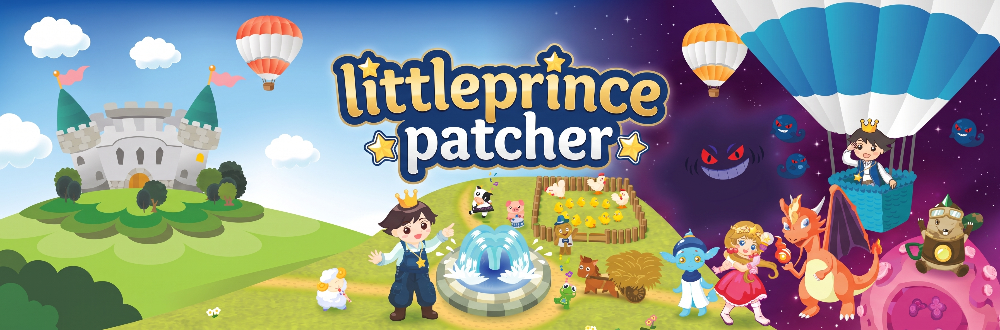

ignore that ai gen banner

# littleprince-patcher

A patcher that patches the game to playable version 

- Little Prince 星願小王子
- Starwish Legend 星願外傳
- Prince Adventure 星願歷奇 (Version 1.4)

## How to install/use

1. Download the game from offical website (find it yourself)
2. Download the patcher from release, then unzip it
3. Put the patcher game folder (/games/) into the game folder that you installed
4. Start the Start_Server.bat
5. Run the game
6. Done

## Patching notes

Which script holds each licence check, the exact edit made, and how to verify a
rebuild before shipping it are documented in **[PATCHING.md](PATCHING.md)**.

## Disclaimer

This project is for educational and preservation purposes only. These are long-discontinued Flash games still answers with an error, and this package exists so that people who already own a copy can keep playing it on their own machine.

* Please respect the company. All games, artwork, music, characters and code belong to their developers and publishers. Nothing here claims any right over them.
* Do not sell or bundle this package commercially, and do not use it for piracy. There are no serial keys, licences or game downloads are provided here.
* Own the game first. Apply the patches only to a copy you legally own, and keep a backup of the original files.
* Support the official release if the company ever makes these games available again.
* If a rights holder asks, this repository should be removed.

